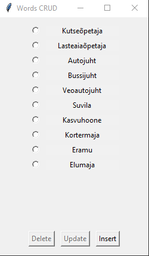

# AppCRUD
Hangmani db CRUD app

## Mis app on?

*Tegemist on koolis poomismängu andmebaasi faili muutmiseks loodud rakendusega. Rakendust saab avada käivitades pythoniga fail AppCrud.py.
Rakendus peaks olema ise ennast seletav ning kasutamine suuremahulist koolitust ei vaja.
*Mitmed read koodi on ka rakenduses sees, millel funktsioon puudub, sest nad kaotasid töö käigus oma eesmärgi.
Alles on nad seepärast, et hilisema arenduse käigus võib juhtuda, et leiavad rakendust.
*Püüdsin teha MVC, kuid kui valmis sai, siis Model osa on kuidagi väga kasin. Püüdsin vägisi osasid asju Controllerist Modelisse tõsta ja muuta, 
kuid suutsin asja ainult katki teha.
*Välimusele, fontidele ja muule tilulilule väga palju tähelepanu ei ole pööratud. Kui vaja, saab seda edaspidi teha.
Eesmärk oli luua võimalikult lihtsasti arusaadav CRUD rakendus, mis vastaks kodusele tööle esitatud tingimustele, panin rõhku sellele, et akna suurust liigutades jääks kõik vidinad oma loogiliste kohtade peale.

## Mis ise sellest sain?
*See on minu jaoks esimene praktiliselt nullist oma pea ja google abiga tehtud rakendus. Ma ei laadinud alla valmis rakendust ja ei kohandanud seda, vaid püüdsin nullist teha rakendust, mida oma vaimusilmas ette kujutasin. Selles osas oli minu arvates väga silmi avardav kogemus. Varasematel kordadel on pigem tehtud nö koopiat juba valmis asjadest.
*Õppisin väga palju asju, sh seda, et ma ikka ei oska veel mitte midagi...
*Oleksin pidanud kohe alguses ikkagi giti kaudu seda tegema. AppCRUD on otsast lõpuni tehtud lokaalselt ning valminuna laetud üles giti.